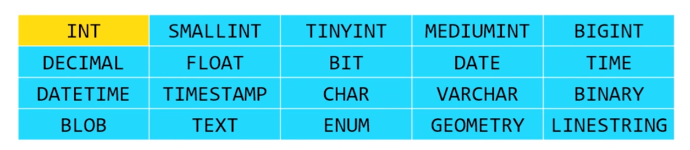
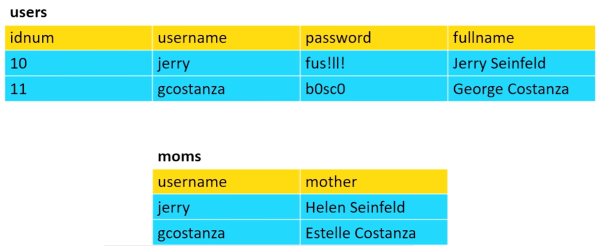
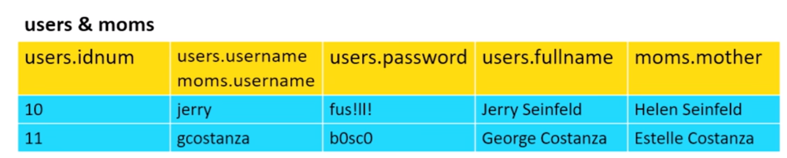
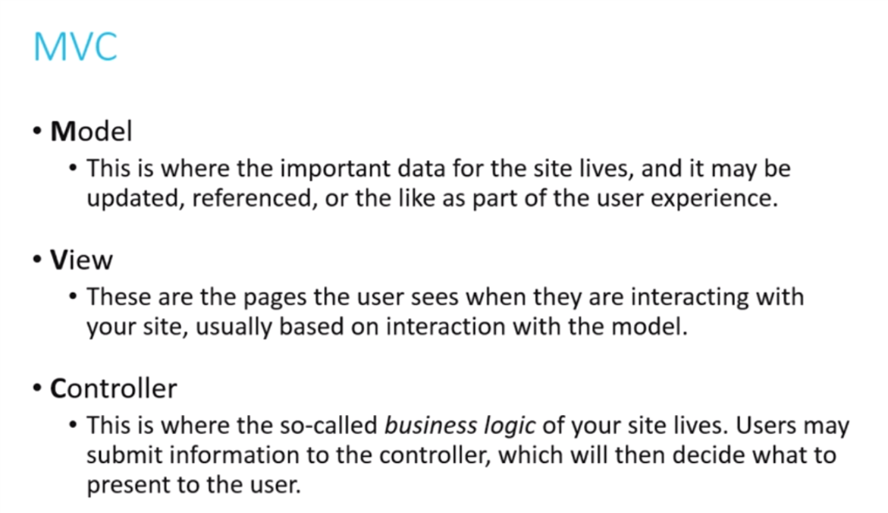
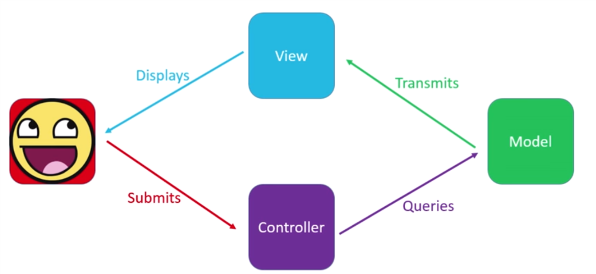
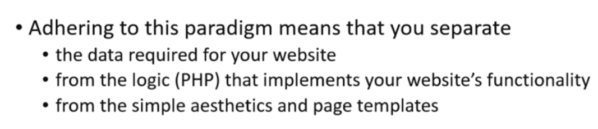
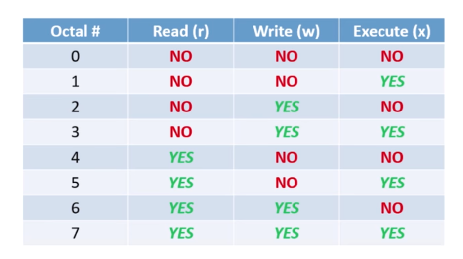
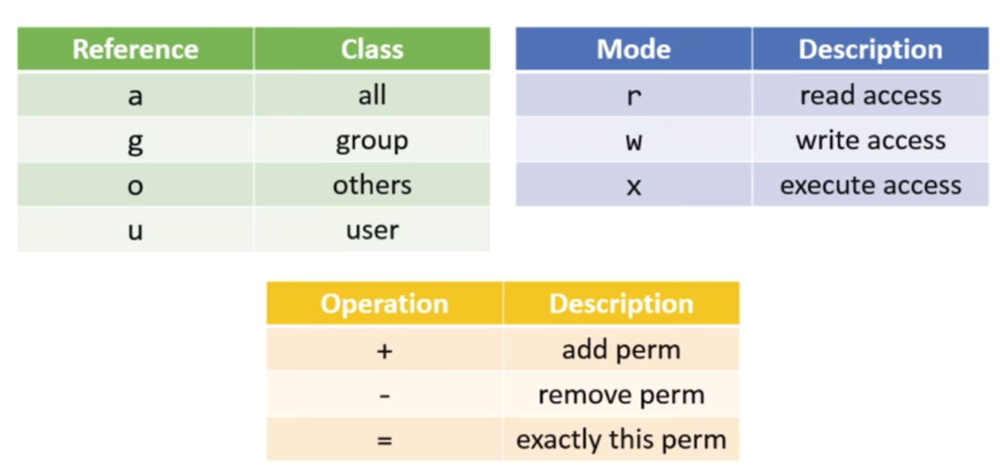

# Shorts

## Flask

Web frameworks:

- make process easier, abstracting away the minutia of Python's syntax and providing helper functions
- Django, Pyramid, Flask


HTML incorporate with python can build website dynamically.

example: display date and time

```python
from flask import Flask
from datetime import datetime
from pytz import timezone

app = Flask(__name__)

@app.route("/")
def time():
  now = datetime.now(timezone('America/New_York'))
  return "The currentdate and time in Cambride is {}".format(now)
```

- import flask module
- initiate a Flask application
- write functions that define the behavior of our application

In Flask, decorators are used to associate a particular function with a particular URL.

run Flask application in CS50 IDE

```shell
export FLASK_APP=application.py
export FLASK_DEBUG=1
flask run
```

Data can be passed in via URLs, akin to using HTTP GET

```python
@app.route("/show/<number>")
def show(number):
  return "You passed in {}".format(number)
```

Data can be passed in via HTML forms, as with HTTP POST, but we need to indicate that Flask should respond to HTTP POST requests explicitly

```python
@app.route("/login", method=['GET', 'POST'])
def login():
  if not request.form.get("username"):
    return apology("must provide username")
```

We could also vary the behavior of our function depending on the type of HTTP request received:

```python
@app.route("/login", method=['GET', 'POST'])
def login():
  if request.method == "POST":
    # do one thing
  else:
    # do a different thing
```

Flask has a number of functions within its module that will be useful for application development

- `url_for()`
- `redirect()`
- `session()`
- `render_template()`

More information:

- [Flask](http://flask.pocoo.org/docs/0.12/quickstart/)
- [Jinja](http://jinja.pocoo.org)

## SQL

database, a hierarchically organized set of tables, each of which contains a set of rows and columns

**SQL**, the Structured Query language, is a programming language whose purpose is to **query** a database. There are many implementation such as:

- **MySQL** is one open-source platform on which you can establish the type of the relational database that SQL is most adept at working with
- **SQLite**
- ...

Many installations of SQL come with GUI tool called **phpMyAdmin**.

### create database -> create table:

- specify all of the **columns**
- queries will refer to **rows** of the table

### data type of SQL:



- different upper bound int
- double, float
- date time stamps
- geometry
- ENUM: store a limited set of values
- CHAR: **fixed-length** string, e.g. `CHAR(10)`
- VARCHAR: variable-length string, but with a maximum, e.g. `VARCHAR(99)`
- BLOB: binary large object

### Primary key

primary keys enable rows of a table to be uniquely and quickly identified. Usually `id` set to auto increment

It is also possible to establish a **joint primary key** - a combination of two columns that is always guaranteed to be unique, e.g. `A1`, `A2`...

### Operation

#### `INSERT`

```sql
INSERT INTO 
<table> 
(<columns>)
VALUES 
(<values>)
```

```sql
INSERT INTO
users
(username, password, fullname)
VALUES
('newman', 'USMAIL', 'Newman')
```

#### `SELECT`

```sql
SELECT
<columns>
FROM
<table>
WHERE
<predicate>  //condition
ORDER BY
<column>
```

```sql
SELECT
idnum, fullname // * specify all columns
FROM
users
WHERE
idnum < 12
```

- `SELECT` (join)

```sql
SELECT
<columns>
FROM
<table1>
JOIN
<table2>
ON
<predicate>
```

```sql
SELECT
users.fullname, moms.mother
FROM
users
JOIN
moms
ON
users.username = moms.username
```



#### `UPDATE`

```sql
UPDATE
<table>
SET
<column> = <value>
WHERE
<predicate>
```

```sql
UPDATE
users
SET
password = 'yadayada'
WHERE
idnum = 10
```

#### `DELETE`

```sql
DELETE FROM
<table>
WHERE
<predicate>
```

```sql
DELETE FROM
users
WHERE
username = 'newman'
```

### Finally

SQL integrates with other programming languages such as Python or PHP very easily.

## MVC

MVC is a programming paradigm that is very commonly-used for web design. It is used to abstract away certain details.







`chmod`





