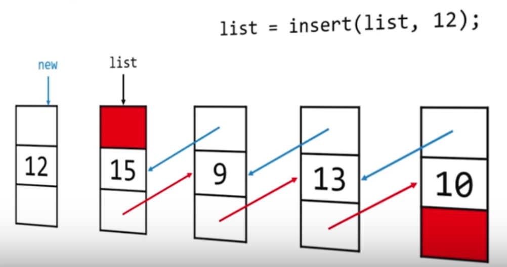
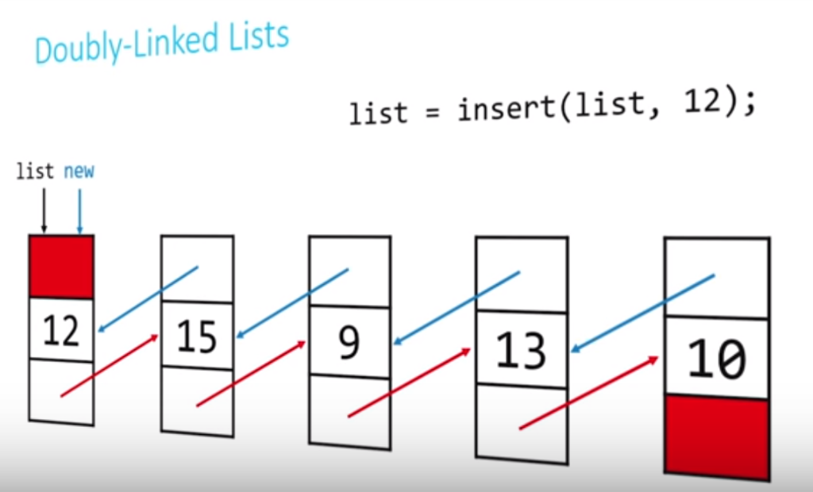
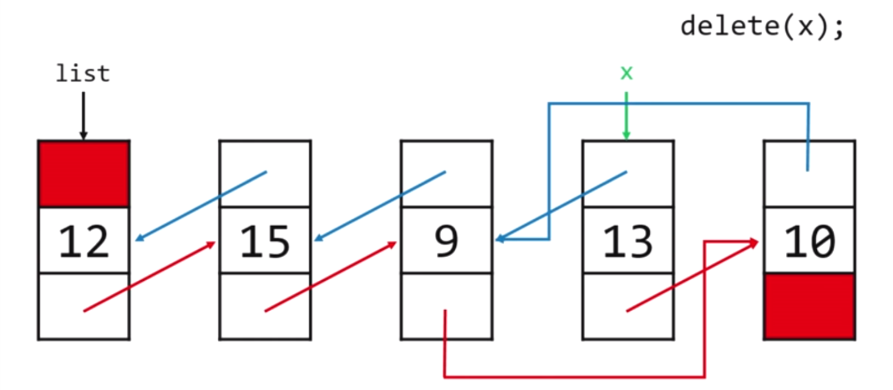
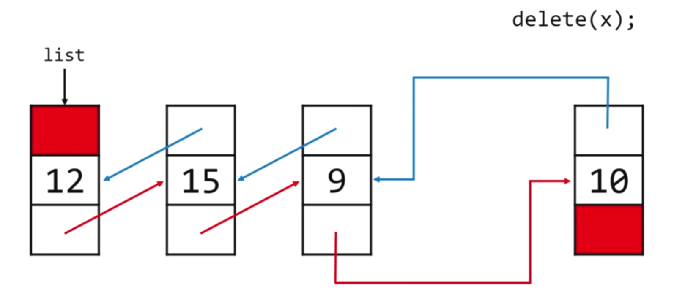
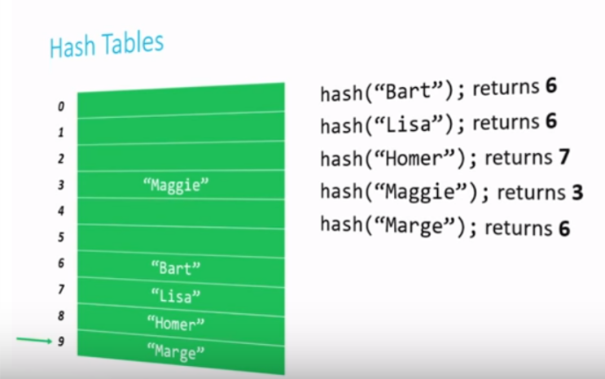
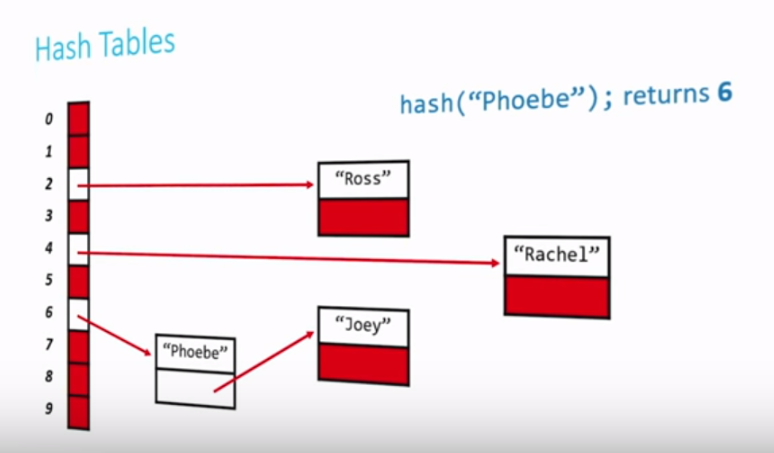
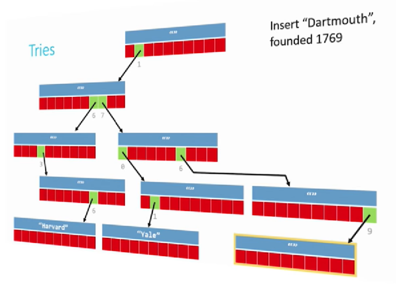

# Shorts

## Singly-Linked Lists

- linked lists allows us to grow and shrink a collection of values and won't have any wasted space
- A linked list `node` is a special kind of `struct` with two members:
  - **data** of some data type
  - A **pointer** to another node of the same type
- in this way,  a set of nodes together can be thought of as forming a chain of elements that we can follow from begining to end.
- ​

```c
typedef struct sllist
{
    VALUE val;
  	struct sllist *next;  // sllist: temparary name
}
sllnode;
```

### operation

create a linked list

- `sllnode *create(VALUE val);`
- dynamically allocate space for a new sllnode;
- check to make sure we didn't run ou t of memory
- initialize the node's val field
- initialize the node's next field
- return a pointer to the newly created sllnode

search through a linked list

- `int find(sllnode *head, VALUE val);`
- create a traversal pointer pointing to the list's head
- if the current node's val is what we're looking for, report success
- if not, set the traversal pointer to the next pointer in the list and go back
- if you're reach the end of the list,  report failure

insert a new node

- `sllnode *insert(sllnode *head, VALUE val);`
- dynamically allocate space for a  new sllnode
- check to make sure we didn't run out of memory
- populate and insert the node **at the beginning of the linked list**
- return a pointer to the new head of the linked list.

delete a single element

- ​

delete an entire linked list

- `void destroy(sllnode *head);`
- if you've reached a `NULL` pointer, stop
- delete the rest of the list
- free the current node

## Doubly-Linked Lists

doubly-linked list allows us to move forward and backward through the list, all by simply adding one extra pointer to our `struct` definition.

```c
typedef struct dllist
{
    VALUE val;
  	struct dllist *prev;
  	struct dllist *next;
}
dllnode;
```

### operation

insert a new node into the linked list

- `dllnode *insert(dllnode *head, VALUE val);`

- dynamically allocate space for a new dllnode

- check to make sure we didn't run out of memory

- populate and insert the node at the beginning of the linked list

- **fix the prev pointer of the old head of the linked list**

  

  

- return a pointer to the new head of the linked list

delete a single element from a linked list

- `void delete(dllnode *target)`

- fix the pointers of the surrounding nodes to "skip over" target

- free target

  

  


linked list, of both the singly- and doubly-linked varieties, support extremely efficient insert and deletion of elements. these operation can be done in **constant time**.

however, we've lost the ability to randomly-access list elements. Acessing a desired element may now take **linear time**.


## Stacks

A stack is a special type of structure that can be used to maintain data in an organized way

This data structure is commonly implemented in one of two ways: as an **array** or as a **linked list**.

**LIFO**

operation

- push: add a new element to the top of the stack
- pop: remove the most recently-added element

### implementation

#### array-based implementation

```c
typedef struct _stack
{
    VALUE array[CAPACITY];
  	int top;
}
stack;
```

`void push(stack *s, VALUE data);`

- accept a pointer to the stack
- accept data of type VALUE to be added to the stack
- add that data to the stack at the top of the stack
- change the location of the top of the stack

`VALUE pop(stack *s)`

- accept a pointer to the stack
- change the location of the top of the stack (**!!no need to delete top element**, next time calling `push` will overwrite it.)
- return the value that was removed from  the stack


#### linked list-based implementation

```c
typedef struct _stack
{
    VALUE val;
  	struct _stack *next;
}
stack;
```

make sure to always maintain a pointer to the head of the linked list

`push()`

- dynamically allocate a new noede
- set its next pointer to point to the current head of the list
- move the head pointer to the newly-created node

`pop()`

- traverse the linked list (`trav` pointer) to its second element (if it exits)
- free the head of the list
- move the head pointer to the (former) second element


## Queues

similar to stacks, but **FIFO**

operation

- **Enquere**: add a new element to the end of the queue
- **Dequeue**: remove the oldest element from the front of the queue


### implementation

#### array-based implementation

```c
typedef struct _queue
{
    VALUE array[CAPACITY];
    int front;
  	int size;
}
queue;
```

`void enqueue(queue *q, VALUE data);`

- accept a pointer to the queue
- accept data of type VALUE to be added to the queue
- add that data to the end of the queue
- change the size of the queue

`VALUE dequeue(queue *q);`

- accept a pointer to the queue
- change the location of the front of the queue
- decrease the size of the queue
- return the value was removed from the queue


#### linked list-based implementation

```c
typedef struct _queue
{
    VALUE val;
  	struct _queue *prev;
  	struct _queue *next;
}
queue;
```

make sure always maintain pointers to the head and tail of the linked list! (global)

`void enqueue(queue *q, VALUE data);`

- dynamically allocate a new node
- set its next pointer to `NULL`
- set the tail's next pointer to the new node
- move the tail pointer to the newly-created node

`VALUE dequeue(queue *q);`

- traverse the linked list to its second element
- free the head of the list
- move the head pointer to the second element
- make that node's prev pointer to `NULL`


## Hash Tables

### pros and cons

Hash table combine the random access ability of an array with the dynamism of a linked list

This means

- Insertion can start to tend toward $\Theta(1)$
- Deletion can start to tend toward $\Theta(1)$
- Lookup can start to tend toward $\Theta(1)$

gaining the advantages of both types of data structure, while mitigating the disadvantages

data itself gives us a clue about where we will find the data

the trade-off is that hash tables are not great at ordering or sorting data! 

### component

A hash table amouts to a combination of two things with which we're quite familiar

- first, a **hash function**, which returns an nonnegative integer value called a **hash code**
- second, an **array** capable of storing data of the type we wish to replace into the data structure

The idea is that we run our data through the hash function, and then store the data in the element of the array represented by the returned hash code.

A good hash function should:

- use only the data being hashed
- use all of the data being hashed
- be deterministic
- uniformly distribute data
- generate very different hash codes for very similar data

### collision

A **collision** occurs when two pieces of data, when run through the hash function, yield the same hash code

#### Resolving collisions: Linear probing



- Linear probing is subject to a problem called **clustering**. Once there's a miss, two adjacent cells will contain data, making it more likely in the future that the cluster will  grow
- the limitation of array (the limitation of hash code)

#### Resolving collisions: chaining

- array of data -> array of nodes

  

  ​

## Tries

Tries combine structures and pointers together to store data.

The data to be searched for in the trie is now a roadmap

- if you can follow the map from beginning to end, the data exists in the trie
- if you can't, it doesn't

Unlike with hashtable, there are no collision.

path: from central root node to a leaf node

insert: simply build the correct path from the root to the leaf

example

```c
typedef struct _trie
{
    char university[20];
  	struct _trie *paths[10];
}
trie;
```



