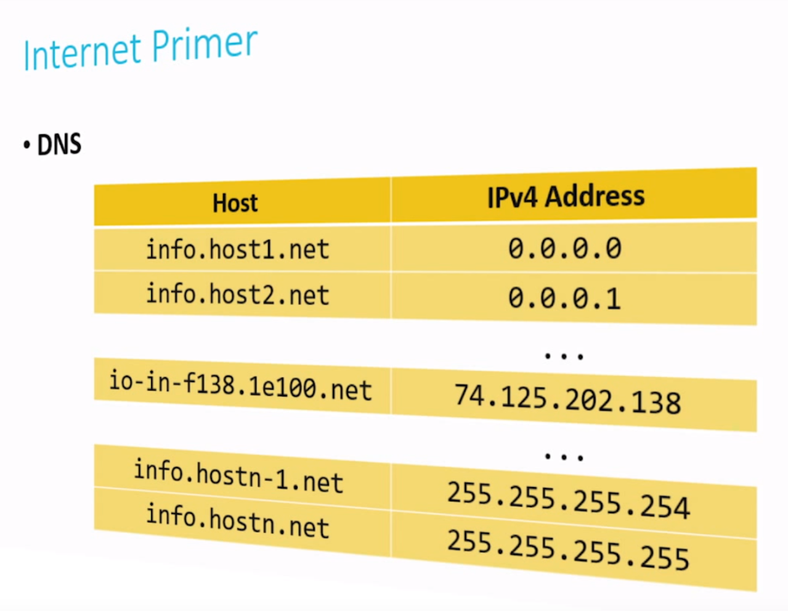

# Notes

## Web Programming

**HTML**: Hyper Text Markup Language, can be represented as a tree, A **DOM**, or Document Object Model

- how the internet works
- how we build software atop it

## Home Networking

- **internet**: interconnection of lots of different networks. on top of internet, do there run services and application
- once connected to modem or wireless device, the **router** will running.
- **router**: route information and also to assign certain settings to your computer
- running inside of router is a **protocol**, a special type of software called **DHCP** - Dynamic Host Configuration Protocol.

## DHCP & IP

- when connect to network, the computer are assigned, thanks to the technology DHCP, an **IP** address.
- **IP address** is a numeric address uniquely identify a computer on the internet, so long as your computer speaks this protocol IP, or the Internet Protocol
- **TCPIP** is a set of conventions that govern how computers talk to each other on the internet
- one of the conventions is what address should look like
  - IP version4: `#.#.#.#` (# is 8bits integer: 0-255)
  - one computer can talk to other computers via IP address on the internet
  - Private IP address: private in the sense that they are used to route information within a particular area (home, schoo, etc)
- **DNS**, Domain Name System: convert numeric IP addresses to more human friendly host names, or **fully qualified domain names**.
- DNS server,convert IP address to host name

## Routers

how to transfer message between your computer and google.com.

the router decide which direction to route information by IP address

## nslookup

look up IP address: `$ nslookup www.google.com`

input: host name

output: IP address

## trace route

information packet:

- TO IP
- my IP
- information

`$ traceroute -q 1 www.google.com` (`q`: query): showing router from local IP to certain server

## Undersea Cabling

undersea cable interconnecting all of the continents and countries of the world

## Packets

the receiver, too, send back information in packets. But the information sometimes too big for packet, so we leverage a feature of IP and its sister protocol TCP that fragment information into multiple packets.

## TCP

TCP allows us to associate sequence numbers with packets.

TCP is often said to **guarantee delivery**.

if missing packets, TCP will ask sender to resend some packets, and receiver have to wait for this. so there may be latency.

one alternative protocol to TCP is **UDP**, that's very often used for live streaming

## Ports

TCP also provides a standardization of services, allows us to uniquely identify the type of service.

| port | type  |
| ---- | ----- |
| 21   | FTP   |
| 22   | SSH   |
| 25   | SMTP  |
| 53   | DNS   |
| 80   | HTTP  |
| 443  | HTTPS |
| ...  | ...   |

- FTP: 
  - file transfer protocol
  - inside this packet is information related to transferring files, not a web page per se.
  - not recommended anymore because it's comply unencrypted
- SSH:
  - secure shell
  - allows you to run commands on PC on a remote server, but in an encrypted way
- SMTP
  - simple mail transfer protocol
  - email
- DNS
  - converts host names to IP addressed and vice versa 
- HTTP
  - webpage

again, packet contains

- information 
- TO address
- FROM address
- Port number
- identify packet (if it's been fragmented)

## Firewall

a firewall is a piece of software that keeps packets out that you don't want coming in.

implement firewall can have routers, for instance, to look at every one of packets and just blacklist certain addresses.

block IP or Port

## VPN

VPN, Virtual Private Network

VPN gives an  encrypted tunnel so that you are connected to the internet. and then you can configure PC to route all, in theory, of internet traffic through the VPN

## Warriors of the Net

animation

## HTTP

inside the packet is messages that conform to **HTTP**, the Hypertext Transfer Protocol.

computers have protocols via which they communicate, and sets of conventions that govern how you start to communicate and how you finish communicating.

## GET

request

```http
GET / HTTP/1.1
Host: www.harvard.edu
...
```

response

```http
HTTP/1.1 200 OK
Content-Type: text/html
...
```

## Status Code

| Status codes |                       |
| ------------ | --------------------- |
| 200          | OK                    |
| 301          | Moved Permanently     |
| 302          | Found                 |
| 304          | Not Modified          |
| 401          | Unauthorized          |
| 403          | Forbidden             |
| 404          | Not Found             |
| 500          | Internal Server Error |
| ...          | ...                   |

## telnet

`telnet` is a program allows us to connect to a remote server specifically on a certain port

example:

```shell
$ telnet www.harvard.edu 80 > output.txt
GET / HTTP/1.1
Host: www.harvard.edu
```

## curl

HTTP headers only

```shell
$ curl -I http://www.harvard.edu/
```

> HTTP & HTTPS

## query string

 HTTP also supports input, specifically input parameters

example: https://www.biaud.com/s?wd=cats

 ## HTML

### hello.html

Hyper Text Markup Language

```html
<!DOCTYPE html>  <!--specify html 5-->
<html>
  <head>
      <title>hello, world</title>
  </head>
  <body>
      hello,world
  </body>
</html>
```

### tree structure



with the help of javascript we can dynamically build these tree.

### image.html

```html
<!DOCTYPE html>

<html>
  <head>
    <titile>image</titile>
  </head>
  <body>
    
  </body>
</html>
```

### link.html

```html
<!DOCTYPE html>

<html>
  <head>
    <titile>image</titile>
  </head>
  <body>
    search for <a href="https://www.google.com/search?q=cats">cats</a>.
  </body>
</html>
```

- tag
- attribute: keyword

### paragraph.html

```html
<html>
  <head>
    <meta name="viewport" content="width=device-width, initial-scale=1"/>
    <title>paragraphs</title>
  </head>
  <body>
    <p>
      this is a paragraph.
    </p>
  </body>
</html>
```

metatag:

- has to go in the head of the web page
- tell the web page to resize itself and the text for whatever the device with is

### headings.html

```html
<html>
  <head>
    <title>headings</title>
  </head>
  <body>
    <h1>One</h1>
    <h2>Two</h2>
    <h3>Three</h3>
    <h4>Four</h4>
    <h5>Five</h5>
    <h6>Six</h6>
  </body>
</html>
```

list.html

```html
<html>
  <head>
    <title>list</title>
  </head>
  <body>
    <ul>  // unordered list
      <li>foo</li>  // list item
      <li>bar</li>
      <li>baz</li>
    </ul>
  </body>
</html>
```

### table.html

```html
<head>
  <title>table</title>
</head>
<body>
  <table>
    <tr>  // table row
      <td>1</td>  // table data
      <td>2</td>
    </tr>
    <tr>
      <td>3</td>
      <td>4</td>
    </tr>
    <tr>
      <td>5</td>
      <td>6</td>
    </tr>
  </table>
</body>
```

## CSS

CSS, Cascading Style Sheets, is another language used in conjunction with HTML. CSS is used to stylize things

### css0.html

```html
<html>
  <head>
    <title>css-0</title>
  </head>
  <body>
    <div style="text-align: center;">
      <div style="font-size: 36px; font-weight: bold;">
        John Harvard.
      </div>
      <div style="font-size: 24px;">
        Welcome to my home page!
      </div>
      <div style="font-size: 12px;">
        Copyright &#169; John Harvard.
      </div>
    </div>
  </body>
</html>
```

### css1.html

```html
<html>
  <head>
    <style>
      body
      {
          text-align: center;
      }
      
      #top
      {
          font-size: 36px;
          font-weight: bold;
      }
      #middle
      {
          font-size: 24px;
      }
      #bottom
      {
          font-size: 12px;
      }
    </style>
    <title>css-1</title>
  </head>
  <body>
      <div id="top">
        John Harvard.
      </div>
      <div id="middle">
        Welcome to my home page!
      </div>
      <div sid="bottom">
        Copyright &#169; John Harvard.
      </div>
  </body>
</html>
```

separate body and style

### css2.html

```html
<html>
  <head>
    <link href="css2.css" rel="stylesheet"/> //relation
    <title>css-2</title>
  </head>
  <body>
      <div id="top">
        John Harvard.
      </div>
      <div id="middle">
        Welcome to my home page!
      </div>
      <div sid="bottom">
        Copyright &#169; John Harvard.
      </div>
  </body>
</html>
```

```css
body
{
  text-align: center;
}

#top
{
  font-size: 36px;
  font-weight: bold;
}
#middle
{
  font-size: 24px;
}
#bottom
{
  font-size: 12px;
}
```

`&#169` html entity, putting certain special characters inside a webpage

## POST

```
POST /login.php HTTP/1.1
Host: www.facebook.com
...
email=username@example.com&pass=12345
```

POST is another way of submitting information to a server, still using the same conventions of HTTP parameter. allows the browser to send information to a server within the request, rather than in the URL.

### search.html

```html
<!DOCTYPE html>
<html>
  <head>
    <title>search</title>
  </head>
  <body>
    <h1>
      CS50 Search
    </h1>
    <form action="https://www.google.com/search" method="get">
      <input name="q" type="text"/>
      <input type="submit"/>
      <input type="submit" value="I'm Feeling Lucky"/>
    </form>
  </body>
</html>
```

