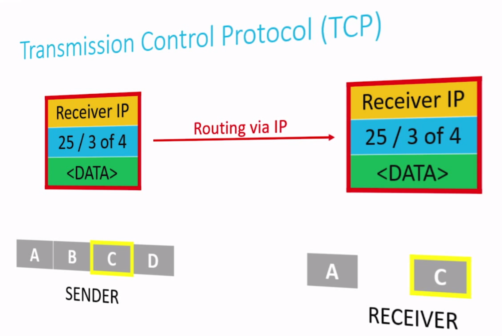
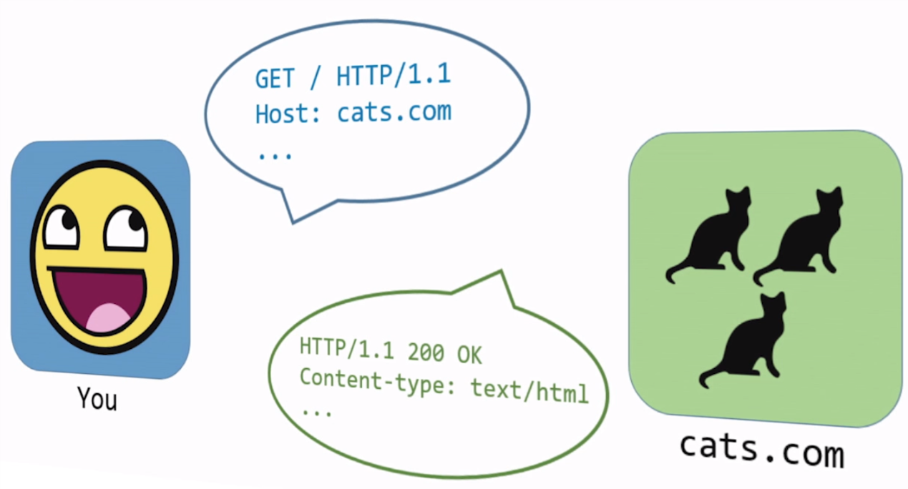
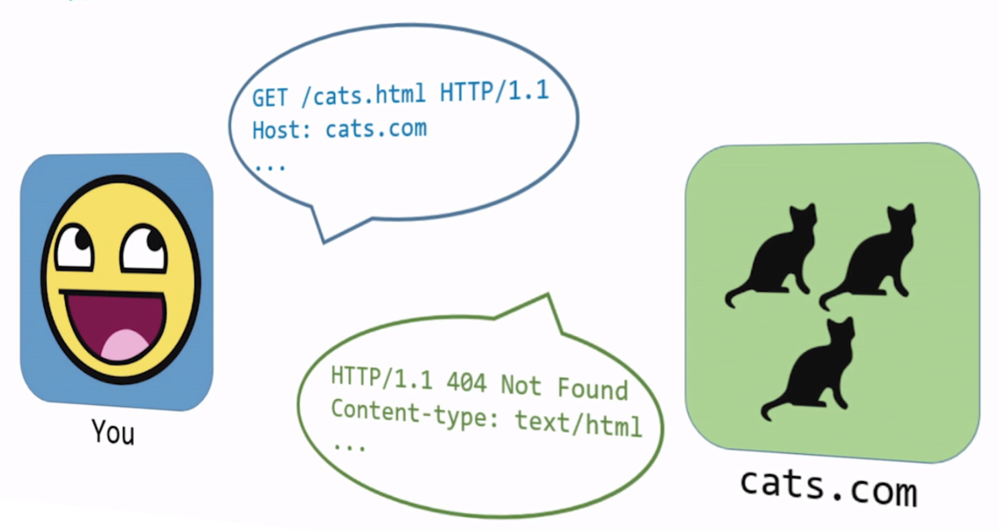
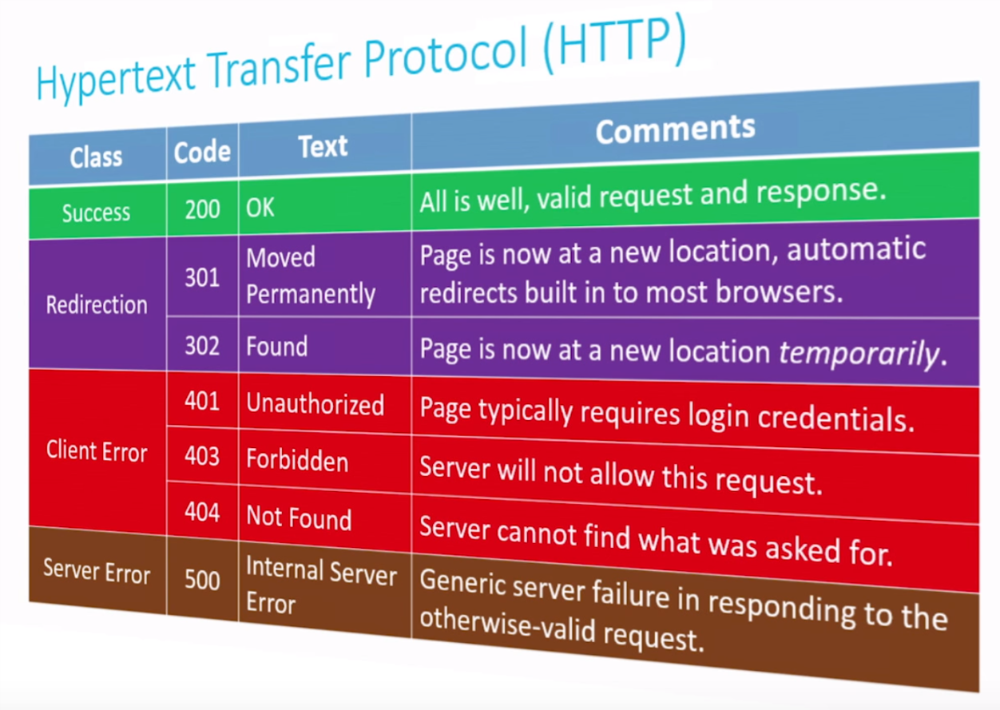

# Shorts

## Internet Primer

 ### IP address

- uniquely identify a computer on the internet
- `#.#.#.#`: 32-bits address representing in decimal per 8 bits (0-255)
- the limitation of IP address: IPv4 -> IPv6
- IPv6
  -  `#.#.#.#.#.#.#.#`
  -  128-bits address representing in hex per 16-bits (0-0xffff)
  -  0 can be omitted

### DHCP

- Dynamic Host Configuration Protocol sever assign IP address to devices

### DNS

Domain Name System (DNS) translate IP addresses to more memorable names that are more human-comprehensible


note that there is really no DNS record of the entire internet. Rather, there are local small scale DNSs that exist.

large DNS server systems are  more like aggregators, collecting smaller sets of DNS information and pooling them together, updating frequently.

### Access Points

one of the ways we've dealt with the IPv4 addressing problem is to start **assigning multiple device to the same IP address**

The IP address is assigned to a **router**, whose job is allows data requests from all of the devices on your local network to be processed through a single IP address

modern home networks consist of access points that combine a router, a modem, a switch, and other tech together into a single device

modern business networks or large-scale wide-area networks (**WAN**) still frequently have these as separate devices to allow the size of their network to scale more easily.

### Internet Primer

Interconnected network -> Internet

internet is a set of rules that allow these networks to communicate to each other.


## IP

the networks are not directly connected to each other at all, and rely on routers to distribute communications

- on a small scale, this configuration may actually be more inefficient than just having direct connections
- on a large scale, this configuration can dramatically reduce the costs of network infrastructure


IP is responsible for moving information and splitting data into **packets**

IP is also known as a connectionless protocol. There is not necessarily a defined path from the sender to the receiver, and vice versa.

## TCP

TCP transmitted packet to the correct program on the receiving machine.

Each program/utility/service on a machine is assigned a **port number**. Coupled with an IP address, we can now uniquely identify a specific program on specific machine.

TCP is crucial for **guaranteeing delivery** of packets, which IP alone does not do.

TCP does this by including information about how many packets the receiver should expect to get, and in what order,  and transmitting that information alongside the data.

steps of the TCP/IP process:

1. when a program goes to send data, TCP breaks it into smaller chunks and communicates those packets to the computer's network software, adding a **TCP layer** onto the packet.
2. IP routes the individual packets from sender to receiver; this info is part of the **IP layer** surrounding the packet
3. when the destination computer gets the packet. TCP looks at the header to see which program it belongs to; and since the routes packets take may differ, TCP also must present those packets to the destination program in the proper order.



## HTTP

HTTP is an **application layer protocol**, which specifically dictates the **format** by which clients request web pages from  a server, and the format via which servers return information to client.





HTTP request line

```http
method request-target http-version
hostname
```

- http-version: always http/1.1
- method:
  - `GET`
  - `POST`
- request-target: what page on the host's server you would like to get

status code

```http
HTTP/1.1 status code
```



visualize request

- open developer tools (chrome F12)
- click `network` tab
- enter a website

## HTML

HTML, Hypertext Markup Language is a markup language

common HTML tags

- `<b></b>`

- `<i></i>`

- `<u></u>`

- `<p></p>`

- `<hX></hX>`

- list

  - `<ul></ul>`
  - `<ol></ol>`
  - `<li></li>`

- table

  - `<table></table>`
  - `<tr></tr>`
  - `<td></td>`

- HTML form

  - `<form></form>`
  - `<div></div>`
  - `<input name=X type=Y />`

  ```html
  <html>
    <body>
      <div>
        Arbitrary first division
      </div>
      
      Here is a form:
      <div>
        <form>
          Text: <input name="a" type="text" />
          Password: <input name="b" type="password" />
          Radio: <input name="c" type="radio" />
          Checkbox: <input name="d" type="checkbox" />
          Submit: <input name="e" type="submit" />
        </form>
      </div>
    </body>
  </html>
  ```

- `<a href=X></a>`: hyperlink

- ``

- `<!DOCTYPE  html>`: Specific to HTML5, lets the browser know that's the standard you're using

- `<!--  -->`: Demarcate the beginning and end of an HTML comment

It's important that the HTML you write be well-formed. Every tag you open should be closed and tags should be closed in reverse order of when they were opened.

Unlike C, your HTML will not necessarily fail with syntax error if not well-formed, so it's up to you to be vigilant

Because it can be an arduous task to investigate this, be sure use online HTML validators to help

## CSS

CSS, Cascading Style Sheets is another language we use to when constructing websites. (customize our website's look and feel)

CSS is a styling language

```css
body
{
    background-colorL: blue;
}
```

- A style sheet is constructed by identifying a **selector** and then an open curly brace to indicate the beginning of the style sheet for that selector
- In between the curly brace you place a list of key-value pairs of style properties and values for those properties, each **declaration** ending with a semicolon.
- Then a closing curly brace terminates the style sheet

common CSS properties

- border: style color width
- background-color: [keyword | #\<6-digit hex\>]
- color: [keyword | #\<6-digit hex\>]
- font-size: [absolute size | relative size]
  - keywords: xx-small, medium...
  - fixed points (10pt, 12pt...)
  - percentage
  - base off the most recent font size (smaller, larger)
- font-family: [font name | generic name]
- text-align: [left | right | center | justify]

selector:

- HTML tags
- ID: `#ID`


- class: `.class`

writing style sheets

- written directly into HTML
- written as separate CSS file and link it to HTML
  - `<link href="CSS file" rel="stylesheet">`


