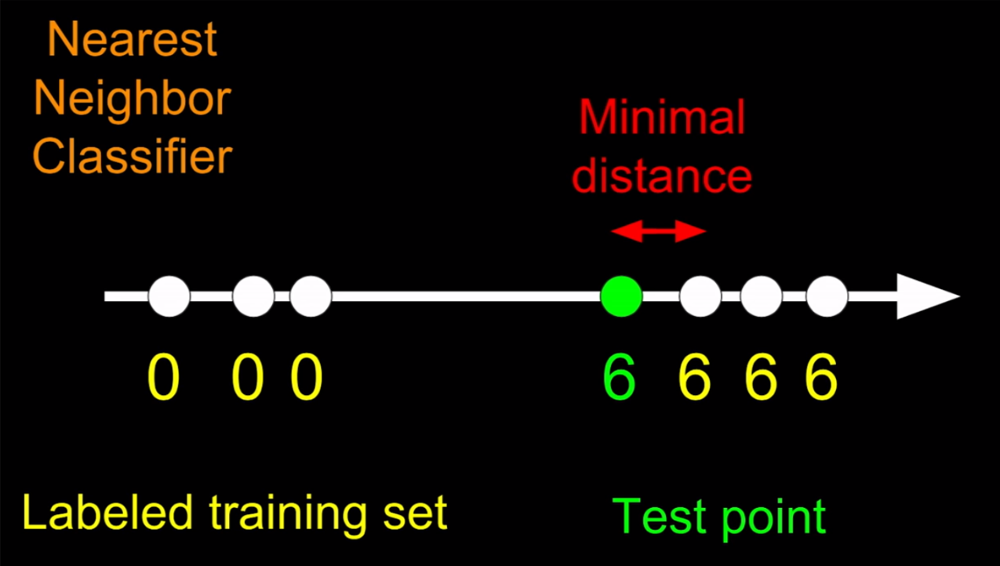
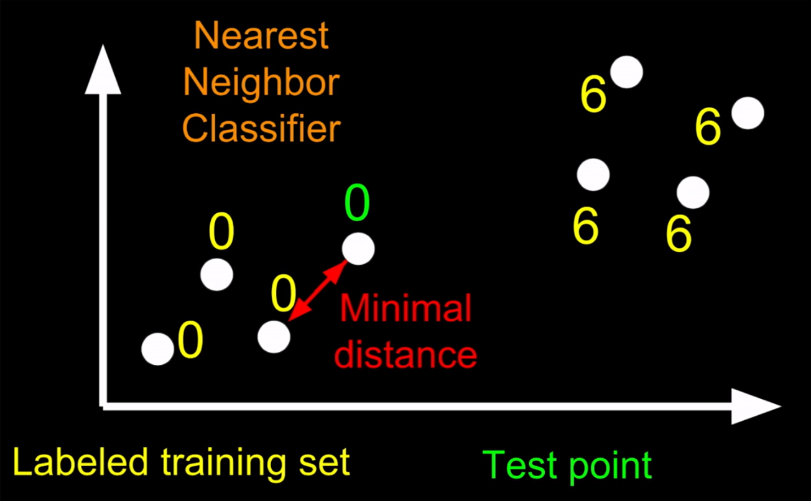
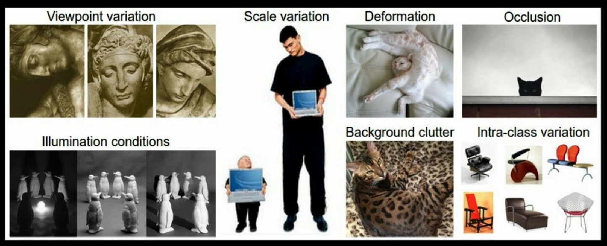
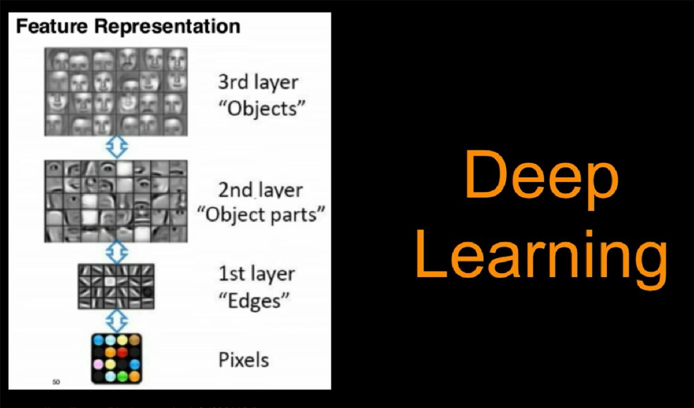
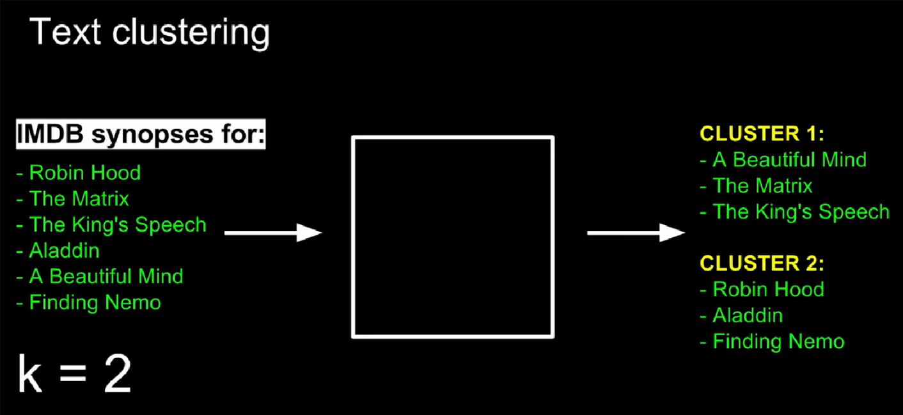
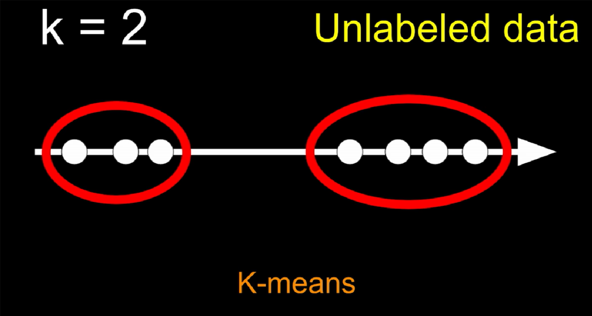
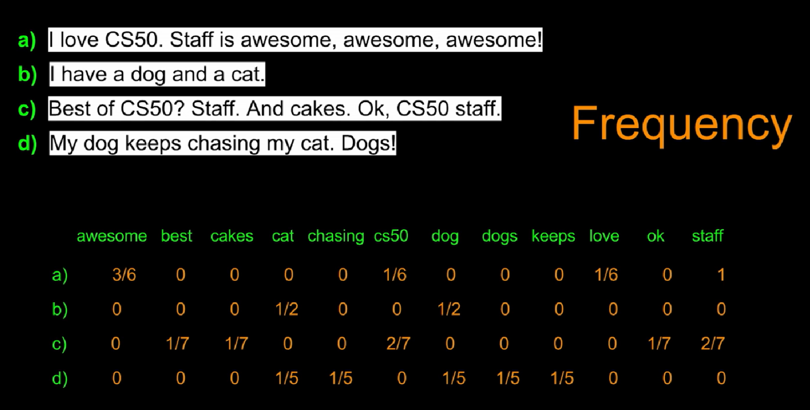

# Week 7

## Introducing Machine Learning

application of machine learning

- search engines
- image recognition
- voice recognition
- natural language processing

training data

## Image Classification

### Labeled training sets

#### Nearest Neighbor Classifier

one dimension

two dimension

64 dimension

#### challenges

### Deep Learning

some tool box

- Tensorflow
- Deep dream generator

### Text Clustering

- unlabeled data
- unsupervised learning

